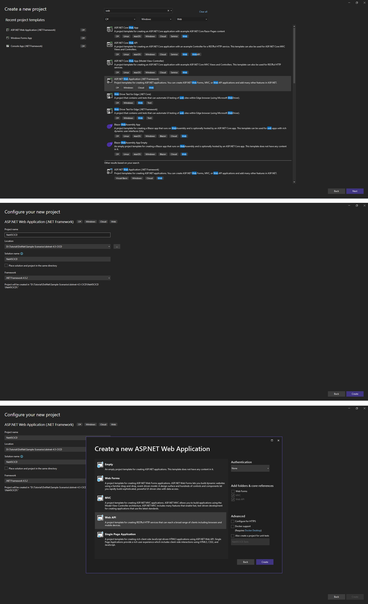
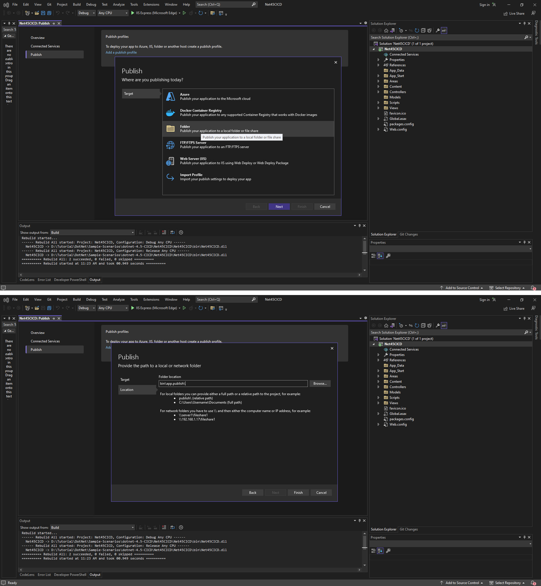
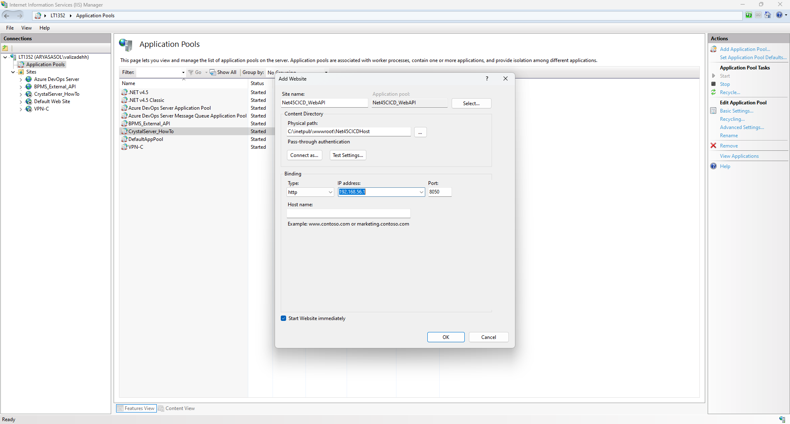
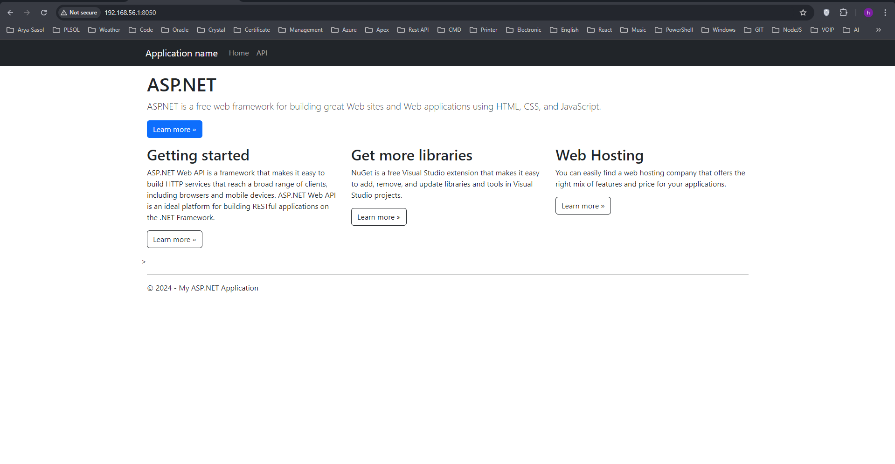
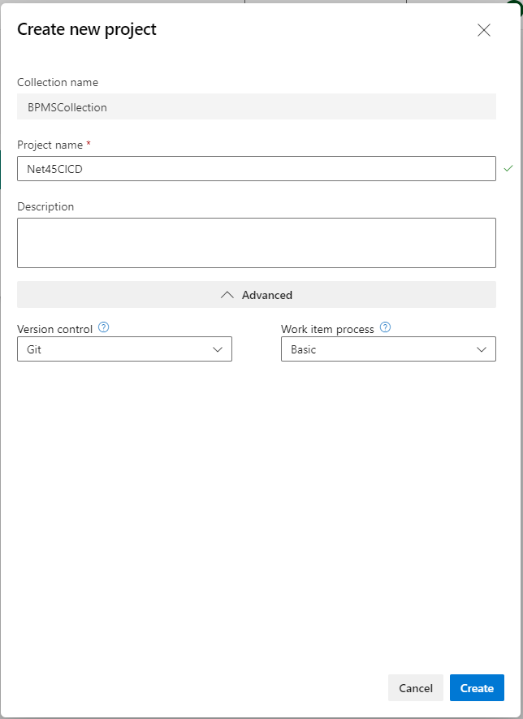
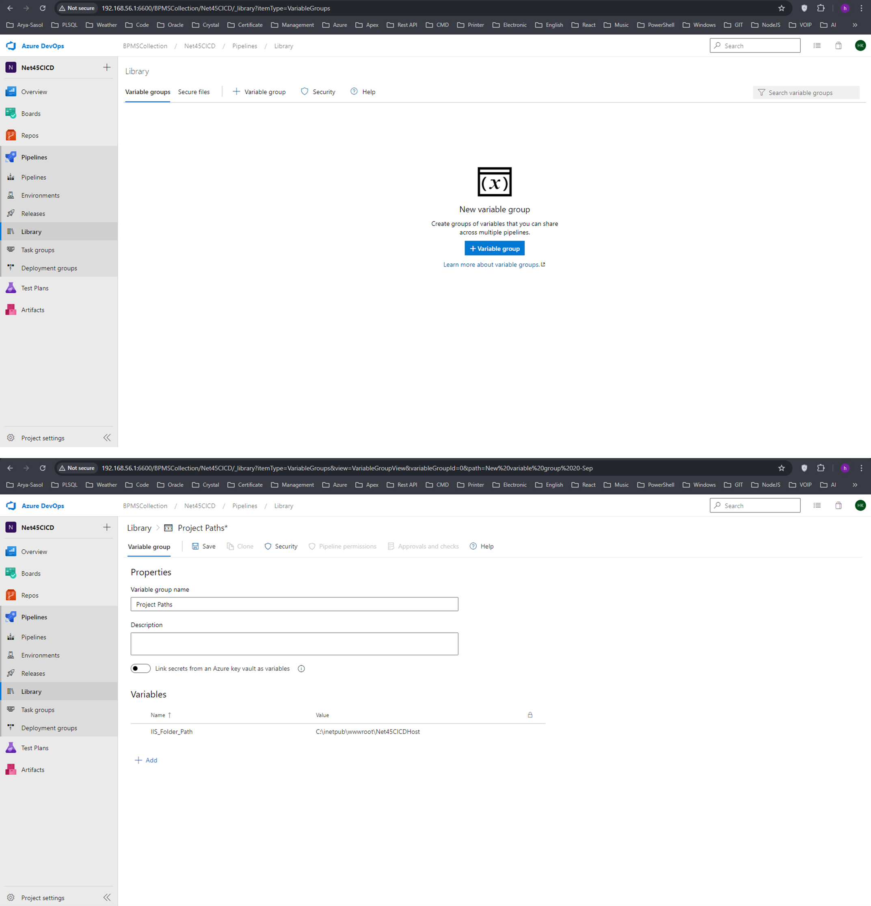
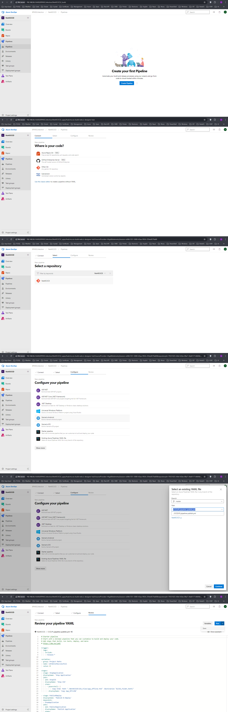

# Subject

we want to create a pipeline in azure DevOps panel for a `dot net framework 4.5 web API`, that builds, publishes, and deploys our `master` branch to the server and hosts it in `IIS` automatically. so we will do the following steps:

- create a WEB API project based on dot net framework 4.5 named `Net45CICD`.
- create a folder in `IIS` named `Net45CICDHost` and manually host the project in `IIS`.
- add a file named `app_offline.htm` to the project.
- prepare the project to be ready for being published with `MSBUILD` tool.
- manually publish the project with `MSBUILD`.
- push the project to the azure DevOps git repository.
- add a `yaml` file to the project to use it to create the CI/CD pipeline.
- create the CI/CD pipeline in azure based on `yaml` file.
- trigger the pipeline and test it


### Create WEB API

open visual studio (in this example we used 2022 version) and choose the template titled `ASP.Net Web Application (.NET Framework)` and enter `Net45CICD` for the `Project Name` and choose `.NET Framework 4.5.2` and finally click on `Create` button. in the opened dialog choose `Web API` and uncheck `Configure for HTTPs`. 





### Host in IIS

to do so, first create a folder named `Net45CICDHost` in the path `C:\inetpub\wwwroot`. and grant full access to this folder to the `IIS_USERS`.

in visual studio click on `Build` tab and select item `Publish Net45CICD` from the opened menu. in the opened dialog select `Folder` as Target and click on `Next` button. on the `Location` dialog do not change any configuration and click on `Finish` button.


 


after this process a file will create in the path `\Properties\PublishProfiles\FolderProfile.pubxml` relative to the root of the project.

now again click on `Build` tab and select item `Publish Net45CICD` from the opened menu. in the opened page click on `Publis` button, if the process is successful a folder in the path `\bin\app.publish` will be created that consists of the published files of the project that are ready to be hosted in `IIS`.   copy the content of this path and paste it in `C:\inetpub\wwwroot\Net45CICDHost` (grant the full access to this folder for the user that runs the Azure DevOps Agent on your host machine).


now open `IIS`and create a web site. to do so right click on `Sites` from `Connections` pane, and from the context menu select `Add Website ...` item. in the dialog opened select a name as `Site name` (we entered `Net45CICD_WebAPI`); enter the path `C:\inetpub\wwwroot\Net45CICDHost` as `Physical Path:` and choose `http` as `Type:`, assign an `IP Address:` (we selected 192.168.56.1) and specify a `Port` (we select 8050 as port), and finally click on `Ok`. 





to test the host, browse your Web API in a web browser. in our example its address is `http://192.168.56.1:8050/`.  you should see the following page.




### Add app_offline.htm

create a folder in the root of the project and name it as `IIS_Files` and create a file named `app_offline.htm` and paste what-ever content you want in it. in our example we pasted the following content:

```html
<!DOCTYPE html>
<html>
<head>
    <title>Web API Is Down</title>
    <style>
        body {
            margin: 0px;
        }

        .background {
            width: 100%;
            height: 100%;
            margin: 0;
            padding: 0;
            background-color: yellow;
        }

        .content {
            position: absolute;
            left: 50%;
            top: 50%;
            -webkit-transform: translate(-50%, -50%);
            transform: translate(-50%, -50%);
            color: #b5b5b5;
            font-size: 50px;
            font-weight: bold
        }
    </style>
</head>
<body class="container">
    <div class="background">
        <div class="content">Web API Is Updating</div>
    </div>
</body>
</html>
```


we will use this file to stop `IIS` responding to the requests to the web API. this way we can safely update our API in CI/CD. 

to do so, you need to copy this file in the the `C:\inetpub\wwwroot\Net45CICDHost`. if you do so and then browse your API in a web browser, you will see the content of the file `app_offline.htm`. this file is used to stop requests to the hosted web applications for the projects of the type `.NET Framework`. it does not stop the `IIS`. 


### Publish with MSBUILD

in previous steps we build and published the project manually. in this step we are going to prepare our project to be able to publish it with `MSBUILD` tool through command.

first install package `MSBuild.Microsoft.VisualStudio.Web.targets` version `14.0.0.3`. 

then open file `Properties\PublishProfiles\FolderProfile.pubxml` and add attribute `xmlns="http://schemas.microsoft.com/developer/msbuild/2003"` to the `Project` tag. the content of the resulting file should be as follow:

```xml
<?xml version="1.0" encoding="utf-8"?>
<!--
https://go.microsoft.com/fwlink/?LinkID=208121.
-->
<Project xmlns="http://schemas.microsoft.com/developer/msbuild/2003">
  <PropertyGroup>
    <DeleteExistingFiles>false</DeleteExistingFiles>
    <ExcludeApp_Data>false</ExcludeApp_Data>
    <LaunchSiteAfterPublish>true</LaunchSiteAfterPublish>
    <LastUsedBuildConfiguration>Release</LastUsedBuildConfiguration>
    <LastUsedPlatform>Any CPU</LastUsedPlatform>
    <PublishProvider>FileSystem</PublishProvider>
    <PublishUrl>bin\app.publish\</PublishUrl>
    <WebPublishMethod>FileSystem</WebPublishMethod>
    <_TargetId>Folder</_TargetId>
  </PropertyGroup>
</Project>
```


now find the location of the `MSBUILD` tool in your computer which usually is in the path `C:\Windows\Microsoft.NET\Framework\v4.0.30319\MSBuild.exe`, and navigate to the path in which the `sln` file of the project resides and execute the following command:

 

```powershell
C:\Windows\Microsoft.NET\Framework\v4.0.30319\MSBuild.exe Net45CICD.sln /p:VisualStudioVersion=11.0 /p:DeployOnBuild=true /p:PublishProfile=..\Net45CICD\Properties\PublishProfiles\FolderProfile.pubxml
```

 

if the publish process occur correctly, a folder containing the published files will be created in the path `..\Net45CICD\bin\app.publish` relative to the root of project (where the file `sln` resides). 


### Git Repository

until here we have a project that is capable of being build by `MSBUILD` tool, and can be hosted in `IIS` manually. to automate this process we need a to have a git repository that based on that trigger a pipeline.

now navigate to Azure DevOps panel and create a new project named `Net45CICD`, with `Git` as version control.

 


in our example the address of our git repository in `http://192.168.56.1:6600/BPMSCollection/Net45CICD/_git/Net45CICD`. 

now that we have an empty git repository in Azure DevOps panel, navigate to the root of project where `sln` file resides and execute the following command to init and push existing project to this remote git repository:

```bash
git init

git remote add origin http://192.168.56.1:6600/BPMSCollection/Net45CICD/_git/Net45CICD

git add --all

git commit -m "init project"

 git push --set-upstream origin master
```

 

### Add YAML File

in this step we will add a `yaml ` file to the project structure and push it to remote git repository on Azure DevOps, to create a pipeline based on it. 

so in the root of project where the `sln` file resides, create following folder structure:

```powershell
CICD
  - PL
```

  now inside folder `CICD/PL` create a file named `pipeline-publish.yml` and paste the following content to it:

```yaml
# Starter pipeline
# Start with a minimal pipeline that you can customize to build and deploy your code.
# Add steps that build, run tests, deploy, and more:
# https://aka.ms/yaml

trigger:
  tags:
    include:
    - release-*

variables:
- group: Project Paths
- name: isPublishSuccessfull
  value: 0

stages:
- stage: StopApplication
  displayName: 'Stop Application'
  jobs:
  - job: StopIIS
    displayName: 'Stop IIS'
    steps:
      - powershell: |
            Copy-Item -Path ".\Net45CICD\IIS_Files\app_offline.htm" -Destination "$(IIS_Folder_Path)"
        displayName: 'Copy App_OFFLINE'

- stage: PublishDeploy
  displayName: 'Publish & Deploy'
  dependsOn:
  - StopApplication
  jobs:
  - job: PublishApplication
    displayName: 'Publish Application'
    steps:
      - checkout: none
      - powershell: |
            C:\Windows\Microsoft.NET\Framework\v4.0.30319\MSBuild.exe Net45CICD.sln /p:VisualStudioVersion=11.0 /p:DeployOnBuild=true /p:PublishProfile=..\Net45CICD\Properties\PublishProfiles\FolderProfile.pubxml
            Write-Host "##vso[task.setvariable variable=isPublishSuccessfull]$LastExitCode"
        displayName: 'Run BUILD And Publish'
  - job: DeployApplication
    displayName: 'Deploy File To IIS'
    dependsOn:
    - PublishApplication
    steps:
      - checkout: none
      - powershell: |
            Copy-item -Force -Recurse -Verbose ".\Net45CICD\bin\app.publish\*" -Destination "$(IIS_Folder_Path)"
        displayName: 'Deploy File To IIS'
        condition: eq(variables.isPublishSuccessfull, 0)

- stage: StartApplication
  displayName: 'Start Application'
  dependsOn:
  - PublishDeploy
  jobs:
  - job: StartIIS
    displayName: 'Sart IIS' 
    steps:
      - checkout: none
      - powershell: |
            $app_offlinePath = "$(IIS_Folder_Path)" + "\app_offline.htm"
            if (Test-Path "$app_offlinePath") {
              Remove-Item "$app_offlinePath" -verbose
            }
        displayName: 'Delete App_OFFLINE'
```


now commit the changes and push to the remote git repository:

```
git add --all
git commit -m "add yaml file"
git push
```


### Create Pipeline

now every thing seems to be ready to create the pipeline in Azure DevOps panel to handle the CI/CD task we desire. to do so, first of all navigate to the project `Net45CICD` in Azure DevOps panel, from the left pane click on `Pipeline` then on `Library`. in the opened page click on the `+ Variable Group`; in the opened page enter `Project Paths` for the field `Variable group name` and and then under `Variables` section click on `+ Add` button and in the field Name enter `IIS_Folder_Path` and and in the field `Value` enter `C:\inetpub\wwwroot\Net45CICDHost`, and finally click on `Save` button. 




now from left pane click on `Pipeline`, from the opened page click on `Create Pipeline` button. in the opened page in `Connect` tab select `Azure Repos Git`, from `Select` tab select your project which is `Net45CICD`, from `Configure` tab select the item named `Existing Azure Pipelines YAML file`, and from opened dialog select the branch `master` and choose the previously added `yaml` file named `pipeline-publish.yml`, and finally in the next page that is a preview of the file, click on the `Save` button that is one of the `Run `drop down button items. 




### Test the pipeline

our pipeline will be triggered with a tag that starts with `release-` on any branch. to trigger it navigate to the `Tags` page from `Repos` item in the left pane and create a new tag on `master` branch that its name starts with `release-`. then go to pipeline page that inspect the behavior on the running pipeline.   